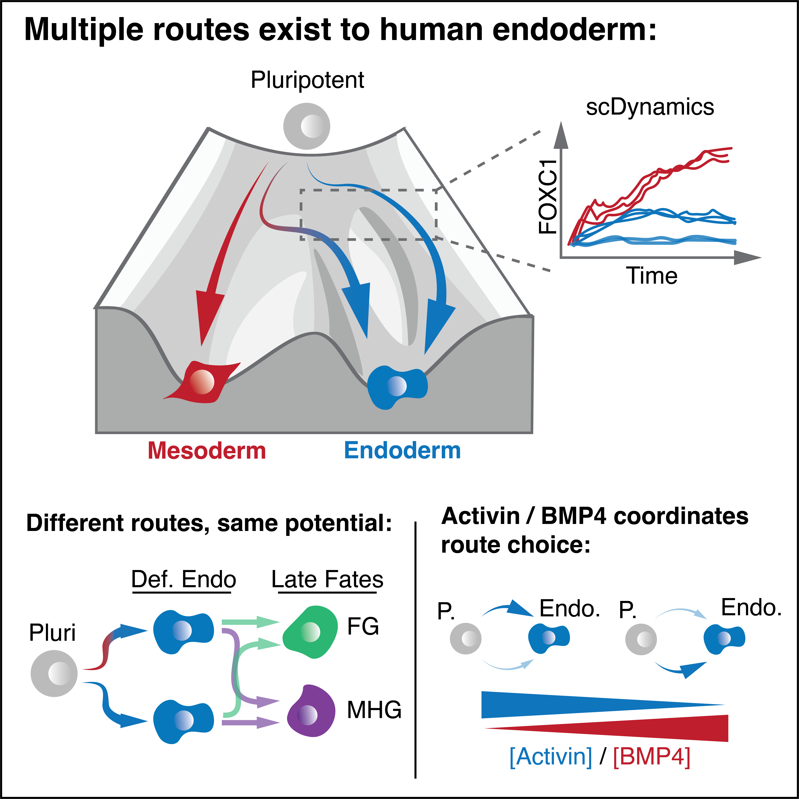

# Inge _**et al.**_ 2025

<table>
  <tr>
    <td style="width: 50%; vertical-align: top;">
      
    </td>
    <td style="width: 50%; vertical-align: top; padding-left: 15px;">
      
  
        
  ## Summary of repository

  This repository contains the code and data analysis for the publication:

  > _Combininatorial BMP4 and Activin direct choice between alternate Routes to endoderm during human Gastrulation (TBC)_
  
  > _<ins>**Oliver Inge**</ins>, Elias Copin, Jake Cornwall-Scoones, Borzo Gharibi, Irene Rodriguez-Hernandez, Pablo Soro-Barrio, Molly Strom, Probir Chakravarty, James Briscoe and Silvia Santos*_

Input data for sequencing is available at GEO: GSE274723.

Resources to generate data are available upon request from Dr. Silvia Santos (silvia.santos@crick.ac.uk).    

   

  </td>
  </tr>
</table>

## Table of Contents 

### Main Figures:

[Figure 1: _Combinatorial Activin and BMP4 guide cell fate decisions from hESCs._](./Figure_1/Figure_1.ipynb)  
[Figure 2: _Modelling cell state transitions reveals need for multiple routes to differentiated fates._](./Figure_2/Figure_2.ipynb)  

### Supplementary Figures:  

[Figure S1: _Cell fate specification is controlled by combinatorial BMP4/Activin (related to Figure 1)_](./Figure_S1/Figure_S1.ipynb)  
[Figure S2: _Markov modelling captures dynamics of BMP4/Activin driven differentiation (related to Figure 2)_](./Figure_2/Figure_S2.ipynb)  

