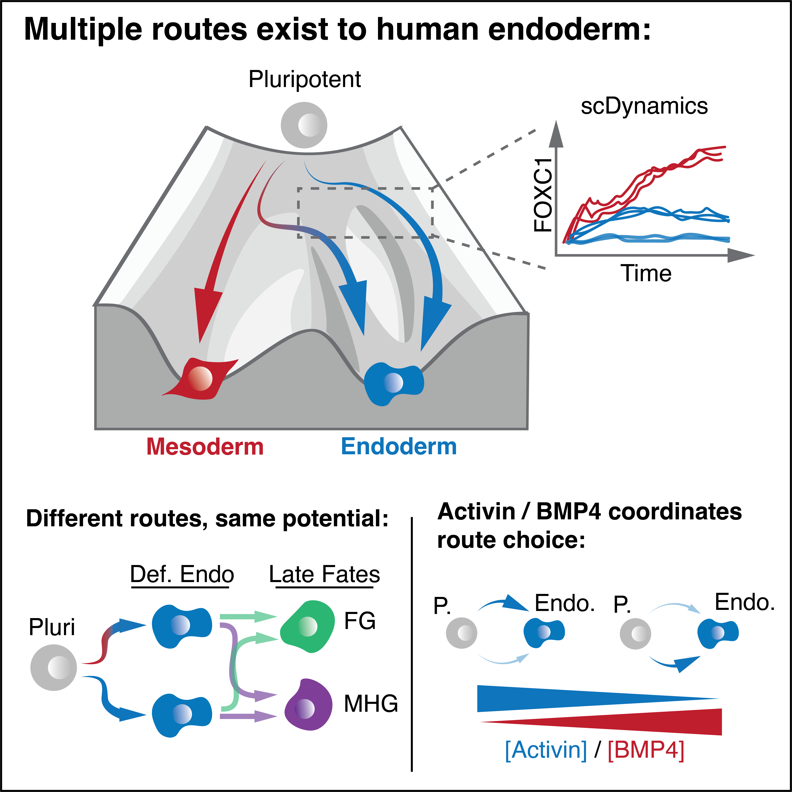

# Inge _**et al.**_ 2025

##  Summary of repository

<table>
  <tr>
    <td>
      
    </td>
    <td style="vertical-align: top; padding-left: 15px;">
      

   This repository contains the code and data analysis for the publication:

  > *Combininatorial BMP4 and Activin direct choice between alternate Routes to endoderm during human Gastrulation (TBC) **Oliver Inge**, Elias Copin, Jake Cornwall-Scoones, Borzo Gharibi, Irene Rodriguez-Hernandez, Pablo Soro-Barrio, Molly Strom, Probir Chakravarty, James Briscoe and Silvia Santos* 
Input data for sequencing is available at GEO: GSE274723.

Resources to generate data are available upon request from Dr. Silvia Santos (silvia.santos@crick.ac.uk).     

      

    </td>
  </tr>
</table>

## Table of Contents 

### Figure 1.

[Figure_1_Cell_Segmentation_Script.bash](./Figure_1_Cell_Segmentation_Script.bash)  
[Figure_1_Dose_response_Analysis_Plotting.ipynb](./Figure_1_Dose_response_Analysis_Plotting.ipynb)  
[Figure_1_Switching_Analysis_Plotting.ipynb](./Figure_1_Switching_Analysis_Plotting.ipynb)  

### Figure S1.

[Figure_S1_4i_Alignment.bash](./Figure_S1_4i_Alignment.bash)  

